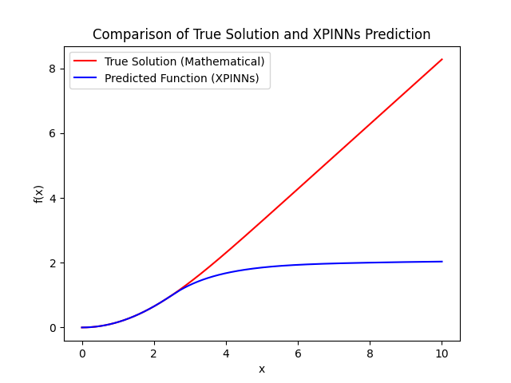

This is a PIDN designed based on PINNs.
By fitting derivative values instead of function values, our method can stably solve the Blasius equation over longer intervals,
whereas the PINNs method often fails to fit correctly over such long intervals.
 Our method, PIDN, has successfully fitted the Blasius equation over intervals ranging from 1000 to 3000, without any involvement of numerical solutions,
  requiring only initial and boundary conditions.
PINNs

XPINNs

PIDNs

